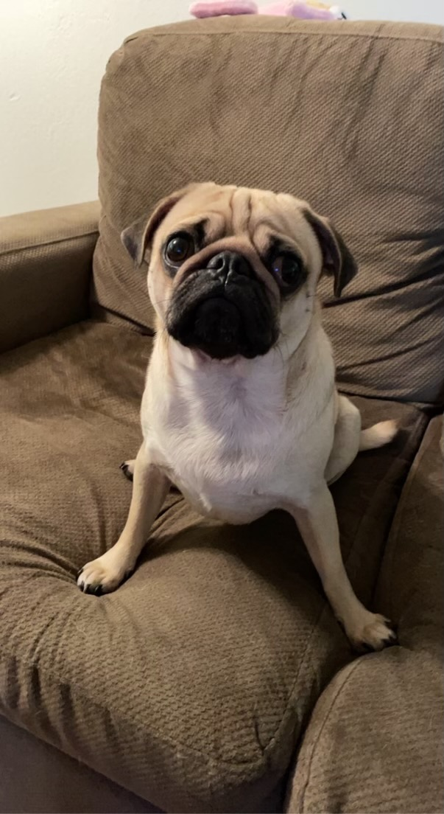

# Katherine Wong

#### UCSD Class of '23
#### Human Biology, B.S. & Computer Science Minor

**About Me**

`print("Hello, nice to meet you!")` 

Hi! My name is Katherine Wong. I am a senior at UC San Diego studying Human Biology with a minor in Computer Science. My interests lie in Healthcare Tech and Biotech and I'm hoping to work in this industry after graduation!

An inspirational quote I currently am motivated by is 
>Our greatest glory is not in never falling, but in rising every time we fall. — Confucius

**Links**

Connect with me on [LinkedIn](https://www.linkedin.com/in/katmwong/)

**Hobbies**
- Baking
- Weightlifting
- Trying new restaurants
- Music
- Petting dogs :^)

**Goals**
- [ ] Meet new people at UCSD
- [ ] Learn new things
- [ ] Achieve Good grades
- [ ] Learn to relax :)

**Music**

My favorite albums at the moment are:

1. Gemini Rights - Steve Lacy
2. Ivory - Omar Apollo
3. Ctrl - SZA

[Read me for this project](README.md)
